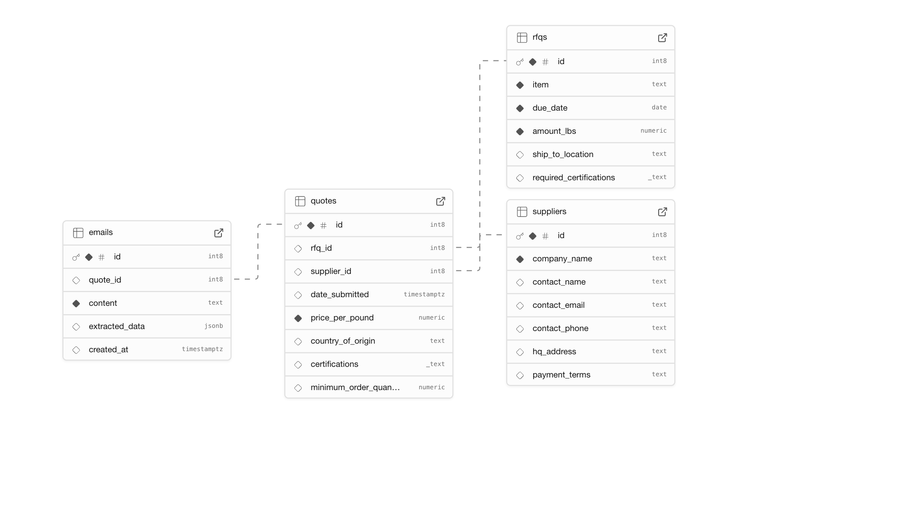
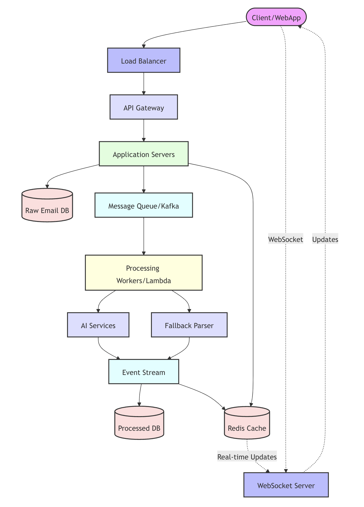

# RFQ Management System

A web-based system for managing Requests for Quotes (RFQs), suppliers, and quote processing using AI-powered email parsing.

## Table of Contents
- [Features](#features)
- [Technology Stack](#technology-stack)
- [Project Structure](#project-structure)
- [Database Schema](#database-schema)
- [Setup and Installation](#setup-and-installation)
- [Environment Variables](#environment-variables)
- [AI Integration](#ai-integration)
- [Code Layout](#code-layout)

## Features
- Supplier Management (Add, Edit, View)
- RFQ Management (Create, View)
- Automated Email Quote Processing using OpenAI/Gemini
- Quote Comparison and Viewing
- Real-time Data Updates
- Responsive Design

## Technology Stack
- **Frontend**: React + Vite
- **Database**: Supabase (PostgreSQL)
- **AI Integration**: OpenAI GPT-3.5, Google Gemini
- **State Management**: React Hooks

## Project Structure
```
src/
├── components/
│   ├── suppliers/          # Supplier-related components
│   ├── rfqs/              # RFQ-related components
│   ├── email_parser/      # Email processing components
│   ├── quotes/            # Quote viewing components
│   └── ui/                # Shared UI components
├── services/
│   ├── openaiService.js   # OpenAI integration
│   └── geminiService.js   # Gemini integration
├── lib/
│   └── supabase.js        # Supabase client configuration
└── App.jsx                # Main application component
```

## Setup and Installation

1. Clone this repository
2. Install dependencies using ```npm install```
3. Configure environment variables

Setup Database in [supabase](https://supabase.com/dashboard/projects)

```sql
-- Suppliers table
create table suppliers (
  id bigint primary key generated always as identity,
  company_name text not null,
  contact_name text,
  contact_email text,
  contact_phone text,
  hq_address text,
  payment_terms text
);

-- RFQs table
create table rfqs (
  id bigint primary key generated always as identity,
  item text not null,
  due_date date not null,
  amount_lbs numeric not null,
  ship_to_location text,
  required_certifications text[]
);

-- Quotes table
create table quotes (
  id bigint primary key generated always as identity,
  rfq_id bigint references rfqs(id),
  supplier_id bigint references suppliers(id),
  date_submitted timestamp with time zone default now(),
  price_per_pound numeric not null,
  country_of_origin text,
  certifications text[],
  minimum_order_quantity numeric
);

-- Emails table
create table emails (
  id bigint primary key generated always as identity,
  quote_id bigint references quotes(id),
  content text not null,
  extracted_data jsonb,
  created_at timestamp with time zone default now()
);
```

Create a .env.local file and add required environment variables:

```
VITE_SUPABASE_URL=your-supabase-url
VITE_SUPABASE_ANON_KEY=your-supabase-anon-key
VITE_OPENAI_API_KEY=your-openai-api-key
VITE_GEMINI_API_KEY=your-gemini-api-key
```

Start the development server
```
npm install
npm run dev
```
## Database Schema


## AI Integration

The system uses a multi-tiered approach for parsing supplier emails:

1. **Primary Parser:** OpenAI GPT-3.5
2. **Secondary Parser(If above fails):** Google Gemini

This secondary parser is for fallback if primary fails for any reason.

## Code Layout

The code is organized by feature/module, making it easy to navigate and maintain.  Key components and services are described below:

**Suppliers Module:**

- `SuppliersTab.jsx`: Main suppliers view and management.
- `SupplierForm.jsx`: Form for adding/editing suppliers.
- `suppliersService.js`: Database operations for suppliers.

**RFQs Module:**

- `RFQsTab.jsx`: RFQ listing and management interface.
- `RFQForm.jsx`: Form for creating/editing RFQs.
- `rfqsService.js`: RFQ-related database operations.

**Email Parser Module:**

- `EmailProcessingTab.jsx`: Email processing interface.
- `emailParserService.js`: Email parsing logic and AI integration.
- `quoteService.js`: Quote creation and management. (Consider renaming to `quotesService.js` for consistency)

**Quotes Module:**

- `ViewQuotesTab.jsx`: Quote comparison and viewing interface.
- `quoteService.js`: Quote retrieval and management functions. (Consider renaming to `quotesService.js` for consistency)

## Proposed Architecture For Future(Long Term)

